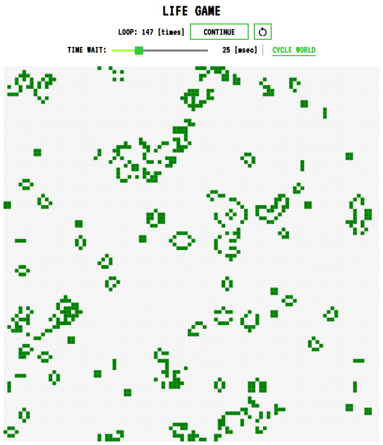

# セル・オートマトン

JavaScript実装のCanvasアニメーションを利用して，セル・オートマトンの動作を楽しみましょう！

## 作品一覧

| ライフゲーム：Conway's Game of Life |     変形粘菌：myxomycetales     |
| :---------------------------------: | :-----------------------------: |
|               |  |

- [**ライフゲーム：Conway's Game of Life**](https://sotaro-ac.github.io/cellular_automata/lifegame/app.html)
  - おそらくは最も有名なセルオートマトンでしょう．
  - 名前に「ゲーム」とありますが，基本的には眺めるだけです．
  - 生命の誕生や死をシミュレーションしているらしいです．
  - 参考にしたアルゴリズムの出典：[Wikipedia「ライフゲーム」](https://ja.wikipedia.org/wiki/%E3%83%A9%E3%82%A4%E3%83%95%E3%82%B2%E3%83%BC%E3%83%A0)

- [**変形粘菌：myxomycetales** ](https://sotaro-ac.github.io/cellular_automata/myxomycetales/app.html)
  - この作品..."実は"セルオートマトンとあまり関係ありません． 
  - 変形粘菌の代表的な種である「**モジホコリ（Physarum polycephalum）**」の動きをシミュレーションしています．
  - 参考にしたアルゴリズムの出典：*Koji Sawa, Tomohiro Shirakawa, and Igor Balaž. 2012. **Cell Motility Viewed as Softness.** Int. J. Artif. Life Res. 3, 1 (January 2012), 1–9.* DOI:https://doi.org/10.4018/jalr.2012010101

- **Coming Soon... Maybe!**

## 注意事項
  - 作品の一部またはすべての動作は外部ライブラリに依存している場合があります．よって，作品ページを読み込む際はインターネット環境に接続する必要があります．
  
  - 当方がプログラムの著作権等を主張することはありません．当プログラムの利用や改変は良識の範疇でご自由に行ってください．ただし，すべての行為は"自己責任"でよろしくお願いします．
